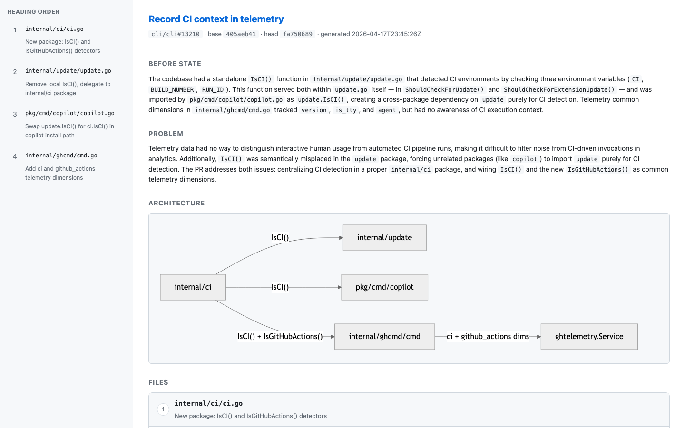
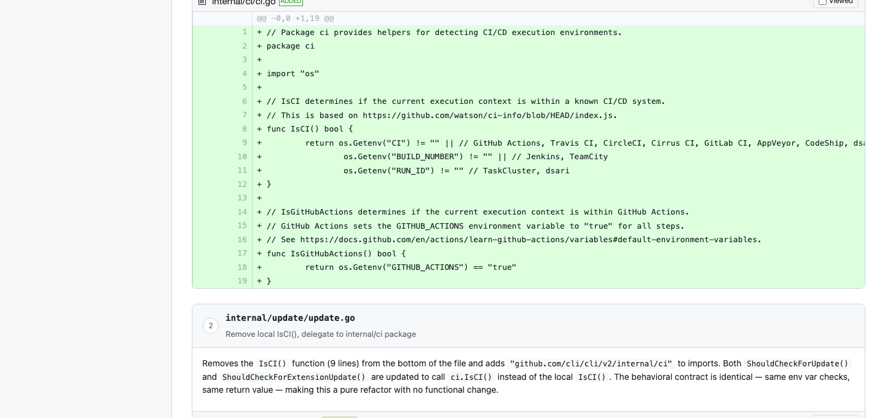
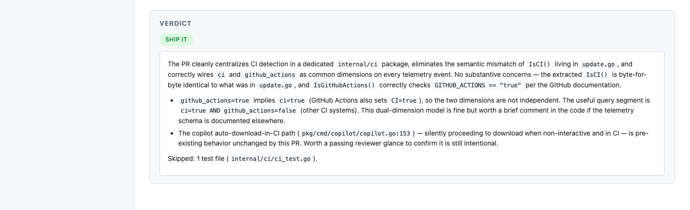

# pr-review

A coding-agent skill that reviews a GitHub pull request by reading the actual codebase (not just the diff) and generating a single self-contained HTML report.

The skill is opinionated about **reading order**: it orders changed files by dependency and execution flow rather than alphabetically, so reviewers build understanding incrementally. It also groups a `before_state`, `problem`, optional Mermaid architecture diagram, per-file summaries, and a verdict into one shareable HTML file. Tests, docs, and lockfiles are excluded from the reading order (but counted in the verdict).

Two ways to use it — pick the one that matches your setup.

## What the output looks like

Run against [`cli/cli#13210`](https://github.com/cli/cli/pull/13210) ("Record CI context in telemetry"):



Each reviewed file gets a short summary, a 2–4 sentence review guide (citing actual symbols the agent read in the code), and its own diff rendered by diff2html:



At the bottom, a verdict block with one of `ship-it` / `ship-with-nits` / `needs-changes` / `blocking-issues` plus the specific concerns a reviewer should raise:



---

## Option A — Use with Claude Code (simplest)

No wrapper script, no extra dependencies. You install the skill, check out the PR branch with `gh`, run `claude` interactively, and ask for a review.

### Prerequisites

- [Claude Code](https://claude.com/claude-code) CLI — `claude`
- [gh](https://cli.github.com/) — GitHub CLI, authenticated (`gh auth status`)
- `git`, and a way to open HTML (`open` on macOS, `xdg-open` on Linux)

### Install

Copy (or symlink) the skill folder into Claude Code's skills directory:

```bash
git clone https://github.com/bibstha/pr_reviewer.git

mkdir -p ~/.claude/skills
cp -r pr_reviewer/skills/review-pr ~/.claude/skills/
# — or, if you want `git pull` to update the skill in place: —
# ln -s "$PWD/pr_reviewer/skills/review-pr" ~/.claude/skills/review-pr
```

Confirm Claude Code sees it:

```bash
claude
# inside Claude Code:
/skills
# you should see 'review-pr' in the list
```

### Usage

```bash
# 1. cd into any checkout of the target repo
cd path/to/repo

# 2. Make sure your working tree is clean, then check out the PR branch:
gh pr checkout 1920

# 3. Start Claude Code and ask for a review
claude
```

Inside Claude Code:

```
review PR #1920
```

or any of:

```
review https://github.com/owner/repo/pull/1920
help me read this PR
generate a review for PR #1920
```

Claude triggers the `review-pr` skill, fetches the PR metadata and diff via `gh`, reads files and greps the codebase for context, writes `pr-review-<owner>-<repo>-<N>.html` in the current directory, and `open`s it in your browser.

When you're done, switch back to your previous branch:

```bash
git checkout -
```

**Caveat:** `gh pr checkout` moves your current working branch. If you have uncommitted work, `git stash` first (and remember to pop when you come back). If that flip-flop annoys you, use Option B.

---

## Option B — Use the `pr-review` wrapper (headless, isolated worktree, multi-model)

Runs the agent headlessly in a dedicated git worktree per PR (so your current branch and working tree are untouched). Streams live progress to your terminal. Lets you swap models freely — Claude Opus, OpenAI Codex, Gemini, Z.AI GLM, etc. — by passing `--model`.

```
$ cd path/to/any/checkout/of/the/repo
$ pr-review 1920
pr-review [omp]: preparing worktree for owner/repo#1920
pr-review [omp]: worktree at /Users/.../repo-pr-1920
pr-review [omp]: running (ctrl-c to abort)…
[session] cwd=/Users/.../repo-pr-1920
→ read path=app/services/foo.rb
✓ (412c)
→ grep pattern=GetEnclaveMarketMakerCompaniesService
✓ (87c)
│ The service adds a new kwarg; presenter calls it.
  claude-sonnet-4-5  8s  in=37416 out=120 $0.12
● done
```

### Why pi-mono / omp under the hood

Rather than building adapters for claude / codex / cursor-agent / … (each with its own flags, auth, and stream schema), this wrapper drives **one** CLI: either [**Oh My Pi**](https://github.com/oh-my-pi/omp) (`omp`, the default — the harness this repo was built under) or [**pi-mono**](https://github.com/badlogic/pi-mono) (`pi`, Mario Zechner's minimalist upstream). They are separate projects, but they share a compatible non-interactive surface — same `--print --mode json --skill` flags, same JSON event schema — so the wrapper treats them as peers via `--agent omp|pi` with zero branching. Both already abstract Anthropic, OpenAI Codex, Google Gemini, GitHub Copilot, OpenRouter, z.ai, and others behind one CLI, one event schema, and one skill loader.

### Prerequisites

- [**omp**](https://github.com/oh-my-pi/omp) (default) or [**pi**](https://github.com/badlogic/pi-mono) (peer). Authenticate with at least one provider via `omp` / `pi` then `/login` inside the TUI, or API keys via env.
- [**wt**](https://github.com/bibstha/wt) — git worktree helper with PR shortcuts.
- [**gh**](https://cli.github.com/) — GitHub CLI, authenticated.
- `git`, `jq`, and a way to open HTML (`open` on macOS, `xdg-open` on Linux).

### Install

```bash
git clone https://github.com/bibstha/pr_reviewer.git
cd pr_reviewer

ln -s "$PWD/bin/pr-review"    ~/bin/pr-review            # ensure ~/bin is on $PATH
ln -s "$PWD/skills/review-pr" ~/.claude/skills/review-pr  # optional: also use with Option A
```

Both symlinks point back into the repo, so `git pull` updates everything in place.

### Usage

```bash
# from inside any checkout of the target repo, mid-feature or not
pr-review 1920                                      # bare PR number
pr-review owner/repo#1920                           # qualified
pr-review https://github.com/owner/repo/pull/1920   # full URL

# pick a specific model — short aliases or any raw pattern omp/pi accepts
pr-review --model opus 1920                         # → anthropic/claude-opus-4-7
pr-review --model codex 1920                        # → openai-codex/gpt-5.1-codex
pr-review --model glm 1920                          # → zai/glm-5.1
pr-review --model anthropic/claude-sonnet-4-5 1920  # raw pattern, passed through
pr-review --list-aliases                            # print the alias table

# swap binaries (default: omp; override once via env or per-call)
PR_REVIEW_AGENT=pi pr-review 1920
pr-review --agent pi 1920

# debugging: emit the agent's raw --mode json stream instead of pretty progress
pr-review --raw 1920
```

`wt switch pr:<N>` creates (or reuses) a worktree checked out at the PR head commit in a sibling directory. The agent runs in that worktree with the `review-pr` skill loaded via `--skill`, writes `pr-review-<owner>-<repo>-<N>.html`, and `open`s it.

Clean up worktrees when you're done:

```bash
wt list              # see what's live
wt remove pr:1920    # tear down a worktree and its branch
```

---

## What's in the box

```
skills/review-pr/       Skill definition (agent-agnostic: just a SKILL.md + template.html)
  SKILL.md              Prompt + workflow the agent follows
  template.html         Single-file HTML report scaffold (diff2html + marked + mermaid via CDN)

bin/pr-review           Shell entrypoint for Option B
docs/screenshots/       Example output from a real review
```

## How the skill works

1. **Fetch** PR metadata (`gh pr view`) and the diff (`gh pr diff`).
2. **Verify** the current working directory is checked out at the PR head.
3. **Classify** changed files into "reviewed" (source code) and "skipped" (tests / docs / lockfiles).
4. **Explore** the codebase with `Read` / `Grep` / `Glob` — callers of modified methods, related schema, tests, config.
5. **Order** the reviewed files by dependency and execution flow (files defining new APIs before files using them; configuration / migrations before code that reads them).
6. **Produce** a JSON analysis: `before_state`, `problem`, optional Mermaid `diagram`, `reading_order` of `{path, summary, details}`, and a `verdict`.
7. **Fill in** `template.html` with the analysis and the raw diff (rendered client-side by diff2html), save it, and open it.

Option B additionally handles `wt switch pr:N` worktree creation and streams per-event progress from `omp`'s JSON output.

## Customizing

The ordering rules, per-file fields, verdict rubric, and output schema all live in `skills/review-pr/SKILL.md` as plain markdown. Edit and re-run — no rebuild, no code change.

The HTML styling lives in `skills/review-pr/template.html`. Tweak the CSS or the included CDN libraries to taste.

## Why a skill and not a web app

An earlier iteration of this repo was a Rails app with Turbo, SolidQueue, an LLM proxy, and a persistent review model. It worked, but it was the wrong shape for a single-engineer review workflow: every session needed a running web server, a background worker, and a checkout service; the agent had no direct filesystem access and saw only the diff. The skill is strictly smaller — the agent runs where the code is, produces a portable HTML artifact, and has no infrastructure to maintain.
